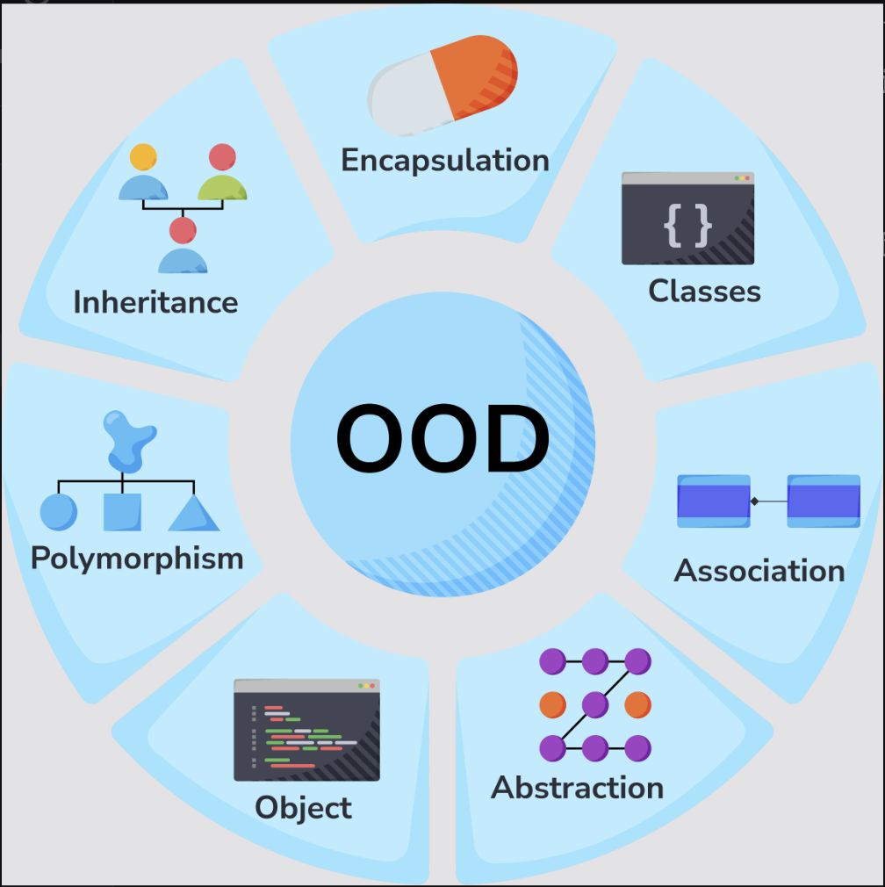
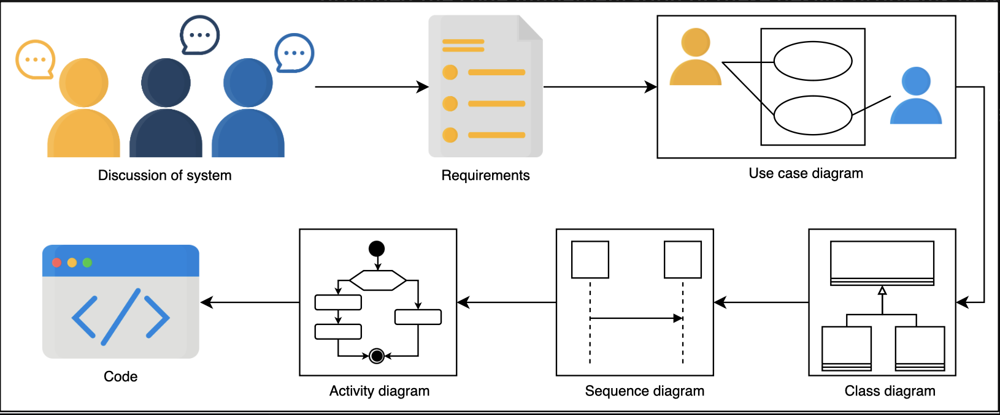

# Overview

> We'll cover the following:
>
> - What is object-oriented design?
> - About this course
> - Intended audience
> - Prerequesities for this course

## What is object-oriented design?

- Object-oriented design (OOD) **uses the object-oriented methodology to design a computational problem and it solution.**
- It allows the application of a solution, **based on the concepts of objects and models.**
- OOD works as a **component of the object-oriented programming (OOP) lifecycle.**
- OOD helps achieve less software development time and high code accuracy, since the design process **_involves object communicating with each other_** and **_displaying the behavior of a program._**

> 

## About this course

> Atypical object-oriented design (OOD) interview is hard. There are so many design problems that can be asked.
>
> Morover, the interviewer expects you to design a near-perfect soltion to the given problem that covers all the edge cases.

This course is about getting familiar with the fundamentals of object-oriented design with an extensive set of real-world problems usually asked in object-oriented design (OOD) interview.

> Start with introduction of the cornerstones of object-oriented programming and object-oriented design with an **_overview of different types of UML diagrams._**
>
> Also review a well known object-oriented design principle, SOLID, followed by the definition and explanation of some of the most widely used design patterns.
>
> Also illustration of 21 real-world design problems mostly asked in FAANG interviews.
>
> The purpose of providing foundational knowledge about object-oriented programming, object-oriented design, design principles, and design patterns before diving deep into the actual design problems is to equip learners with the essential conceptual foundations.
>
> > In each design problem, we have presented a detailed discussion of the problem requirements.
> >
> > Findings are modeled with the help of use cases, as well as class, sequence, and activity diagrams for each problem.
> >
> > For the benifit and ease of learners, the code implementation of these design problems are provided.
> >
> > 

## Intended audience

For those who aim to ace the object-oriented design (OOD) interview for dream job.

> Here's how object-oriented design can help you advance in the tech industry:
>
> - **Software developers:** to design their systems efficiently.
>
> > The object-oriented design allows code to be reusable in a way that reduces redundancy leading to a shorter, more readable code. Therefore, employing object-oriented design allows for easier collaborations, which increases productivity and leads to faster development of software.
>
> - **Project/product managers:** a big challange in project or product management is to build systems that scale well and perform effectively over time. Managers that are aware of object-oriented design can design systems much more effeciently.
>
> - **Object-oriented design learners:** individuals in tech domains can greatly benifit from learning object-oriented design. Helps learners understand how different real-world problems can be developed through the object-oriented model.
>
> - **Interview preperation:** object-oriented design is becoming an important part of software development interviews. This course helps software engineers prepare for interviews in big tech companies.

## Prerequisites for this course

- fundamental concepts of object-oriented design.
- well-versed in the syntax of object-oriented programming for any one programming language.
