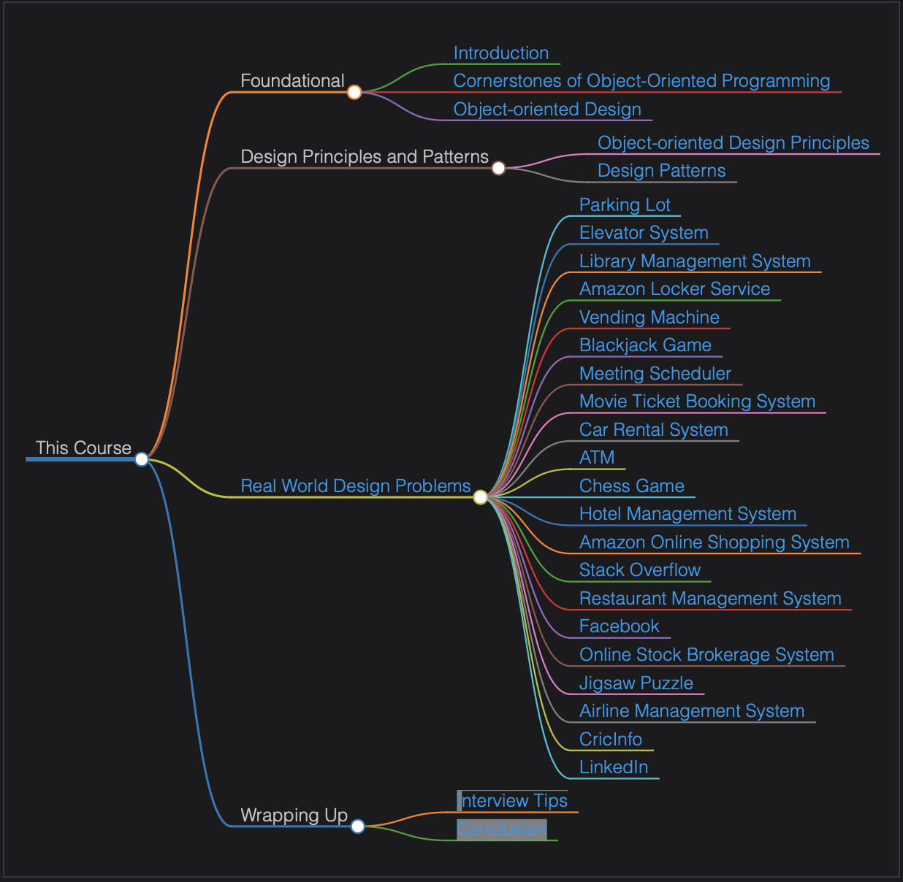

# Introduction

> We'll cover the following:
>
> - Structure of the course
> - Course strengths

## Structure of the course

This course consists of 28 chapters. These chapters are segmented in four sections listed below:

- Foundational: (3 chapters)
  - First chapter introduces the course and its key features.
  - Second chapter talks about object-oriented programming and its four paradigms.
  - Third chapter introduces UML notations, and we focus on four widely used UML diagrams in object-oriented design.
- Design patterns: (2 chapters)
  - First chapter introduces the five design principles widely in object-oriented programming software development called SOLID.
  - Second chapter discusses the three design patterns: **creational, structural, and behavioral.**
- Real-world design problems: (21 chapters in this section)
  - First chapter explains a typical object-oriented design interview process. (steps involved in solving a design problem.)
  - Chapter 6-27 describe and solve the 21 real-world design problems in detail.  
    (dedicated a chapter for each problem in which we walk the learner through all the phases of designing an object-oriented problem.)
  - These chapters include requirement gathering, use case diagrams, class designs, sequence and activity diagrams, as well as the skeleton code implementation in five popular languages.
- Wrapping up: provides interview tips for the reader and wraps up this course.

> Readers will find it useful to read them in the sequence provided below.
> 

## Course strengths

While filling some important gaps in other available courses, we believe this course has some key strengths to offer.

#### Strengths

- Self-contained  
  provides one-stop solution to all the concepts required to solve real-world object-oriented design interview problems.
- Incremental improvement to design  
  provides a layer-by-layer design solution by designing simple and incremental solutions to complex problems using bottom-up approach.
- Solving the traditional problems  
  up-to-date with the latest real-world problems that top-ranked companies use in their interviews to evaluate a candidate's object-oriented design skills.
- New design problems  
  provides an upskill by presenting new design problems being asked in FAANG interviews lately.
- Careful collection of design problems  
  each problem has its unique aspects in terms of problem-solving and designing.
- Modular approach
  design problems using a bottom-up approach.
- Interview structure  
  tried to cover all aspects of the interview process related to OOD and have provided useful hints to solve the problems.

> "All the best for your journey."
