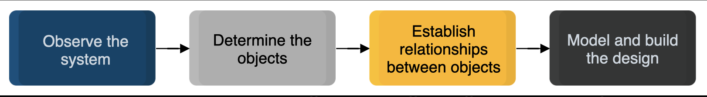

# Introduction to Object-oriented Analysis and Design (OOAD)

Get introduced to the basics of object-oriented analysis and design.

> We'll cover the following:
>
> - OOAD in the SDLC
> - Object-oriented analysis
> - Object-oriented design
> - Advantages of OOAD

## OOAD in the SDLC

The **Software Development Life Cycle (SDLC)** refers to the sequence of phases involved in software development.

> The stages of SDLC are shown below:
> 
>
> The object-oriented analysis and design (OOAD) in SDLC allows one to analyze and design a system using object-oriented concepts and visualize each aspect of the OOAD process.
>
> In OOAD, we examine and inspect the entire system required for a particular problem, followed by identifying what it refers to as "objects" present in the system.
>
> It then establishes a relationship between the different objects and works on modelling and building a design for the whole system.
>
> This entire process is summarized in the following diagram:
>
> 

Let's explore the analysis and design stages of the OOAD process in further detail.

## Object-oriented analysis

Object-oriented analysis is the method

- where the system requirements are identified,
- which are then used to create a model based on defining the roles of the objects present in the system and tasks for which the system is responsible.

The analysis step excludes any implementation details.  
Rather, we identify different use cases here.

## Object-oriented design

Object-oriented design is the phase where the implementation of the defined requirements and the models created during the analysis phases begins.

> In this step, the models are further refined by adding additional constraints and making decisions such as adding new elements to the given initial structure.
>
> At this stage, the designer also goes into the inner details of the defined models and elaborates if any object-oriented principle is required.

These models are usually built using **Unified Modelling Language (UML)** diagrams such as class or sequence diagrams which will be explained in detail in this chapter....

## Advantages of OOAD

The object-oriented analysis and design process is highly well-known.  
The following are a few reasons why it is quite renowned among the community:

- It's extremely easy to understand, which helps in creating models of complex problems.
- Concepts such as inheritance help make the data reusable and scalable.
- It's easy maintainable, which helps identify the issues in the early processes and saves time.

> Let's look at the Unified Modeling Language (UML) in the next lesson.....
