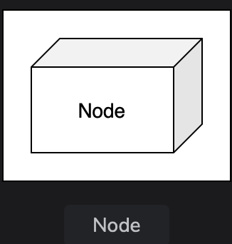

# Introduction to the Unified Modeling Language

Get introduced to the Unified Modeling Language (UML).

> We'll cover the following:
>
> - What is UML?
> - UML basic notations
>   > - Things
>   >   > - Structural things
>   >   > - Behavioral things
> - Benefits of using UML

## What is UML?

(models offer us a way to view the system from different angles.)  
Unified Modeling Language (UML) is a standard way of visualizing a system's design.

> UML is not a programming language but is used to visualize a system's behavior and structure.
>
> It is known for providing tools to software engineers and developers that allow them to analyze, design, and develop software systems and model processes.
>
> **UML is the perfect language to explain the inner workings of the software system** to all the stakeholders involved - from an analyst to an author.

## UML basic notations

UML is composed of three main building blocks: **things, relationships, and diagrams.**  
(these three exist at the center of UML and play a key role in producing effective and easily understandable models.)

Let's look at these building blocks in details.

> **Note:** Relationships and diagrams of building blocks are discussed in upcoming lessons.

### Things

This building block itself is divided into the following various types:

- Structural things
- Behavioral things
- Grouping things
- Annotation things

> Grouping and annotation things' functionality is pretty much the same as their names.

Let's explore the structural and behavioral things in detail.

##### Structural things

The structural things represent a system's physical aspects, such as a class, object, interface, use case, actor, component, and node.

> A description of these is provided below:
>
> 1. **Class:** The notation represents the attributes and members of an object.
>    
> 2. **Object:** This notation refers to the instance of a class.
>    
> 3. **Interface:** This notation represents the functionality without its implementation.
>    
> 4. **Use case:** This notation describes the user's goals and possible interactions with the system.
>    
> 5. **Actor:** This notation represents the entities interacting with the system.
>    
> 6. **Component:** This notation represents a section of the system.
>    
> 7. **Node:** This notation is similar to the component notation, with the difference being that the node notation refers to the physical aspect of a system, such as a server.
>    

##### Behavioral things

The behavioral things represent the various system's interactions and functions, such as state machines, activity, and interaction diagrams.

> The explanation of these behavioral things is given below:
>
> 1. **Activity diagram:** These describe the various interactions performed by different components present in the system.
>    
> 2. **Interaction diagram:** These diagrams describe the message flow between the different components present in the system.
>    

## Benefits of using UML

The following are the advantages of using UML:

- It's extraordinarily flexible and easy to understand for all different stakeholders, even those who don't have any technical knowledge.
- It's widely used and has a large community, which makes it easier to perform collaborative work among teams.
- It has an abundance of tools that helps break complex systems into smaller pieces.

> Let's explore the various types of UML diagrams in this lesson....
