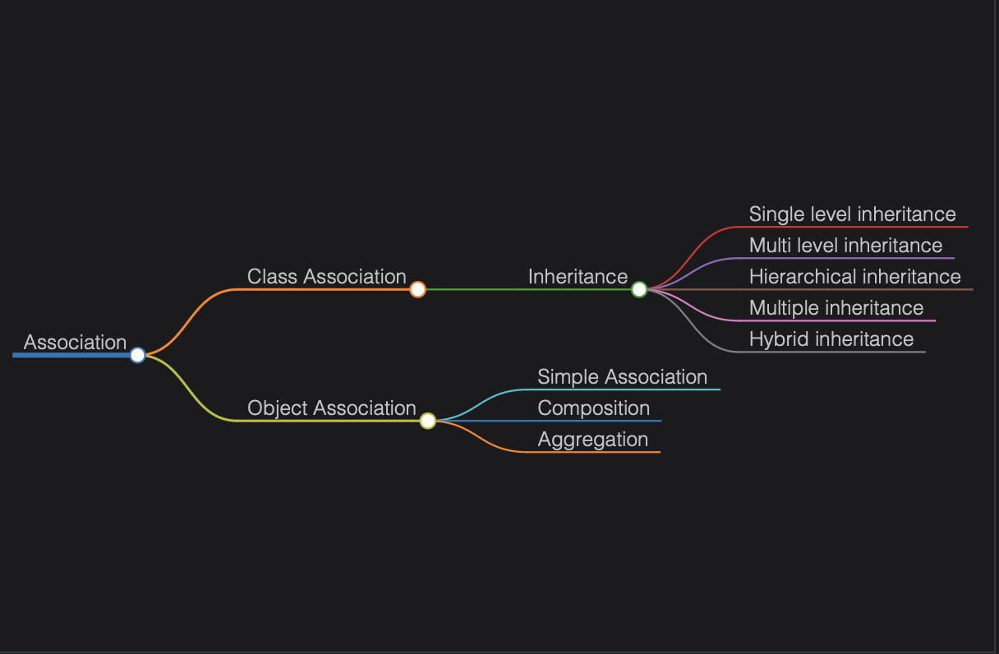

# Class Diagram

Learn the concept of class diagrams and relationships between classes and their notations.

> We'll cover the following:
>
> - Why use classes diagrams?
> - Popular notations in the class diagram
>   > - Class notation
>   > - Interface, abstract class, and enumeration
>   > - Access modifiers
> - Association
>   > - Class association
>   > - Object association
>   >   > - Simple association
>   >   > - Aggragation
>   >   > - Composition
>   >   > - Some additional types of association
> - Dependency

Class diagrams are used to depict the system's static perspective.  
 They are used in the design process to show the shared roles and responsibilities of the entities that produce the behavior of the system.

Class diagrams are widely used in the modeling of object-oriented designs because...  
 ...this is the **only UML diagram that can be directly transferred to object-oriented programming languages.**

## Why use class diagrams?

The following are some important purposes of the class diagram:

- Represents the system's static structure.
- Directly maps with object-oriented languages.
- Represents what the system's duties or responsibilities are.
- Uses in both forward and reverse engineering.

## Popular notations in the class diagram

The following are some essential notations of the class diagram:

- Class notation
- Interface, abstract class, and enumeration
- Access modifiers

## Class notation

A class is represented by a rectangle with three sections.  
 The first section holds the class name,  
 the second one lists the attributes, and  
 the third one shows the methods (operations).

> Following is the depiction of a "Movie" class with its attributes and methods.
>
> 

## Interface, abstract class, and enumeration

We can declare a class as abstract using **abstract** keyword.  
 The class will be printed in italic.  
 We can use interface, annotation, and enum keywords too.

> The illustration below shows how to depict these notations in a class diagram.
>
> 

## Access modifiers

You can use character symbols to specify the visibility of the associated object when defining methods or attributes.  
 The most widely used access modifiers are as follows:

- **Public:** A public member can be seen anywhere in the system.  
  It is represented by + symbol.
- **Private:** Members can only be accessible from within the class.It is inaccessible from outside the class.  
  It is represented by - symbol.
- **Protected:** Members are only accessible within the class and derived classes.  
  It is represented by # symbol.

> The following images show how to use the access modifiers in the class diagram:
>
> - 

## Association

Association provides a mechanism to communicate one object with another object, or one object provides services to another object.  
 Association represents the relationship between classes.

The association can be divided into two categories:

- Class association (Inheritance)
- Object association
  

### Class association

Inheritance falls under the category of class association.  
 Creating a new class from the existing class(es) is called **inheritance.**  
 Apart from its own behaviors and attributes, the child class inherits the characteristics of its parent(s).  
 A solid line leads from the child class to the parent class with a hollow arrowhead representing the inheritance relationship.

### Object association

Object association (relationship between objects) can be divided into the following categories:

1. Simple association
2. Composition
3. Aggregation

#### Simple association

The weakest connections between objects are made through simple association.  
 It is achieved through reference, which one object can inherit from another.  
 Example of a simple association.

#### Aggragation

Aggregation describes the relationship between the container and the object it contains.  
 An object may contain an aggregate of another object.  
 Aggregate is denoted by a line with an unfilled diamond head towards the container.

> Aggregation is a weaker relationship because:
>
> - Aggregate objects are not a part of the container.
> - Aggregate objects can exist independently.
>
> 

#### Composition

An object may be composed of smaller objects, and the relationship betweem the "part" objects and "whole" objects is known as **composition.**  
 Composition is denoted by a line with a filled diamond head at the composer class pointing to the component class.

> Composition is a strong relationship because:
>
> - The composed object becomes a part of the composer.
> - Composed objects can not exist independently.
>
> 

## Some additional types of association

The following are some types of simple associations based on navigation:

- Single-direction navigation is called **one-way association** and is denoted by an arrow towards the server object.
  ![class diagram of one-way association]
- If we navigate in both directions, the association is called a two-way association and is denoted by a line between two objects.
  
- Binary, ternary, and n-ary associations are based on the amount on the number of objects.
  

## Dependency

Dependency indicates that one class is dependent on another class(es) for its implementation.  
 Another class may or may not depend on the first class.  
 ** A dashed arrow denotes dependency.**

> 
>
> In the example above, we have two classes - RegistrationManager and Student.  
>  The RegistrationManager class relies on the Student class for its behavior because the object of the Student class is passed as a parameter to one of the functions in the RegistrationManager class.

> In the next lesson, we will look at the sequence diagram and its notation in detail....
