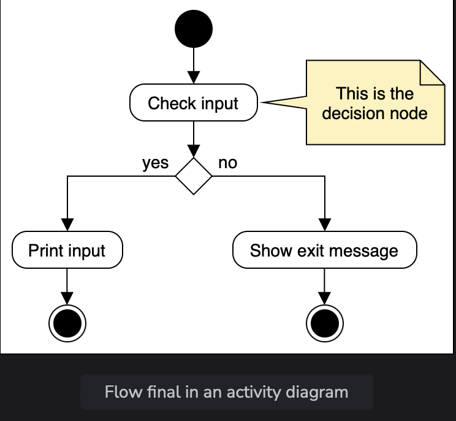

# Activity Diagram

Learn how activity diagrams represent interactions between actors and objects.

> We'll cover the following:
>
> - Purpose of activity diagram
> - Components of an activity diagram
> - How to draw an activity diagram
>   > - Determine the actions of the system
>   > - Finding the flow of each activity
>   > - Create the diagram
> - Sequence vs. activity diagram

An activity diagram is a **communication diagram that is used to show the dynamic aspects performed by a system.**  
 This diagram is used to represent a series of actions, similar to how they may appear in a flowchart.

## Purpose of activity diagram

Activity diagrams are also used to show the sequence through which events occur in the system.

Activity diagrams differ from other UML diagrams in that they specifically capture the message flow for each activity on to the next.  
 These may look like flowcharts in appearance, but in execution, they can be much more.  
 (they can show various flows, such as single, parallel, concurrent, and branched.)

## Components of an activity diagram

(various components make up an activity diagram)

> Let's discuss some of the essential features of this diagram that appear most often.
>
> - **Initial:** This represents the start of workflow of the activity diagram.  
>   Can be visualized as the node in a tree structure.  
>   
>
> - **Action:** These are the main building blocks of an activity diagram and are used to show the activities that a modeled process is made of.  
>   
>
> - **Flow final:** This represents the end of a single path in the activity diagram.  
>    Can be visualized as leaf in a tree structure.
>   
>
> - **Activity final:** This represents the end of all the activities in the activity diagram.
>   
>
> - **Control flow:**  
>    This shows the directional flow of the diagram. This exists as a connector between one action and another.
>   
> - **Object flow:**  
>    This shows the path of the objects as they move throughout the activity.
>   
> - **Decision:**  
>    This is used to represent multiple options that are possible in a system. They appear as a branch alongside the text describing the condition for the path.
>   
> - **Merge:**  
>    This uses the same symbol as a decision. However, this shows that multiple options join at this node, but leads to a single output.
>   
> - **Fork and join:**  
>    The **_fork node_** represents _a single activity that is split into two concurrent activities happening alongside each other._  
>    On the other hand, the join node joins two concurrent activities together to lead to a single activity.
>   

## How to draw an activity diagram

Activity diagrams show the message flow of actions in a simple manner.  
 Important to understand that there isn't one correct way of creating an activity diagram.

This lesson introduces a methodology that helps break down the problem into smaller, achievable tasks.

### Determine the actions of the system

> Here we recognize each action and how they interact with the others in the system.  
>  (use the aid of use cases to make this process easier.)
> Example where a customer wants to withdraw cash from an ATM.  
> 
>
> Determine the actors and their roles, and list down all the actors and objects that will be involved in the entire message flow of the activity.
>
> These would be the following:
>
> - Customer
> - ATM
> - Transaction
> - Account
> - Cash dispenser

### Find the flow of each activity

> First work out the order in which the actions should occur, and also note down the action that coincides with other actions.
>
> Here, we also determine the conditions that lead to specific outcomes.
>
> Lastly, we note if there are actions that can only be executed once a previous one is completed.

### Create the diagram

> Now, we will use these steps to build a sample activity diagram.
> 

## Sequence vs. activity diagram

Differences that exist between both of them:

**Sequence diagram:**

- Is is used for dynamic modeling.
- It visualizes the flow of messages from one object to the other.
- It helps in modeling the systems workflow.
- It describes the behavior of various objects just for an independent use case.

**Activity diagram**

- It is used for functional modeling.
- It visualizes the flow of messages from one activity to the other.
- It helps in visualizing a systems sequence of calls for a particular functionality.
- It describes the general sequence of actions for various objects as well as various use cases.
