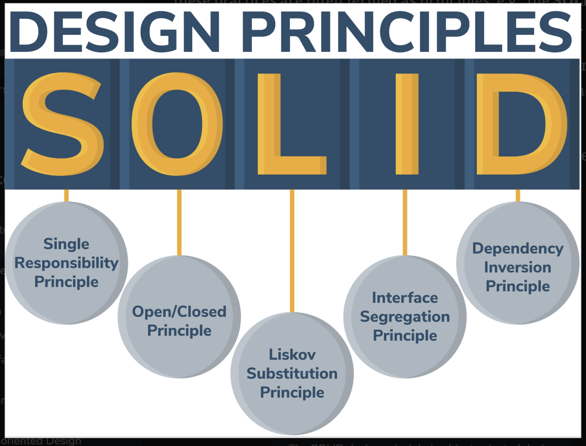

# Introduction to SOLID Design Principles

Get introduced to the SOLID design principles.

> We'll cover the following:
>
> - Introduction
> - Why use SOLID principle?
> - Design principles

## Introduction

When creating a software, we can follow **good practices to avoid issues to make our code easier to understand, robust, and maintainable.**  
 Few of these practices are often termed as principles, e.g., the SOLID principles refer to the best practices to be followed in OOD.

> SOLID is an acronym for the first five object-oriented design (OOD) principles by _Robert C. Martin,_ also known as Uncle BOB.
>
> The illustration represents the acronym for SOLID design principles:
> 

## Why use SOLID principles?

> Let's look at possible issues below that may occur in the code if we don't adhere to the SOLID priniciples.
>
> - The code may become tightly coupled with several components, which makes it **difficult to integrate new features or bug fixes and sometimes leads to unidentified problems.**
> - The code will be untestable, which effectively means that **every change will need end-to-end testing.**
> - The code may have a **lot of duplication.**
> - Fixing one issue results in additional errors.

However, if we adhere to the SOLID principles, we are able to do the following:

- **Reduce tight **coupling of the code, which reduce errors.
- **Reduce the code's complexity** for future use.
- Produce **more extensible, maintainable, and understandable software code.**
- Produce the **code that is modular, feature specific, and is extemely testable.**

## Design principles

Definition of five design principles:

- Single Responsibility Principle (SRP)  
   Each class should be responsible for a single part or functionality of the system.
- Open Closed Principle (OCP)  
   Software components should be open for extension but closed for modification.
- Liskov Substitution Principle (LSP)  
   Objects of a superclass should be replaceable with objects of its subclasses without breaking the system.
- Interface Segregation Principle (ISP)  
   Makes fine-grained interfaces that are client specific.
- Dependency Inversion Principle (DIP)  
   Ensures that the high-level modules are not dependent on low-level modules.  
   In other words, **one should depend upon abstraction and not concretion.**

> In the next few lessons, we will explain these five design principles in detail....
