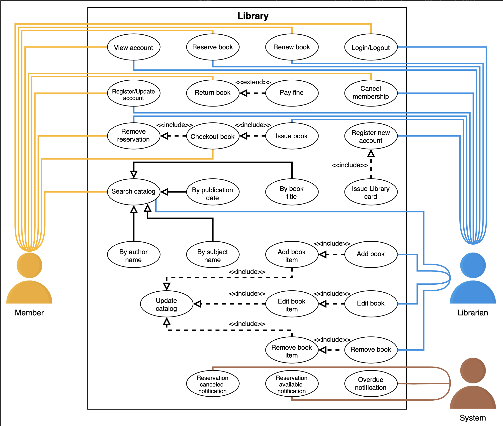

# Use Case Diagram for the Library Management System

Learn how to define use cases and create the corresponding use case diagram for the library management system.

> We'll cover the following:
>
> - System
> - Actors
>   > - Primary actors
>   > - Secondary actors
> - Use cases
>   > - Librarian
>   > - Member
>   > - System
> - Relationships
>   > - Generalization
>   > - Associations
>   > - Include
>   > - Extend
> - Use case diagram

Let's build the use case diagram for the library management system and understand the relationship between its different components.

## System

Our system is a "library."

## Actors

Define main actors of our library management system.

### Primary actors

- **Member:** This actor is the client of the library.  
   It can search, reserve, renew, or return a book and modify its library membership.
- **Librarian:** It acts as an admin in a library management system.  
   It can add or remove a book as well as modify the status of members or books.  
   It can also issue and return books.

### Secondary actors

- **System:** It can send alerts related to reservations and late returns of books.

## Use cases

Define the use cases for the library.

Use cases are listed according to their respective interactions with a particular actor.

> **NOTE:** You will see some use cases occurring multiple times because they are shared among different actors in the system.

### Librarian

- **Add book:**  
   To add a new book to the library.
- **Remove book:**
  To remove an existing book from the library.
- **Edit book:**
  To modify a book.
- **Register new account:**  
   To register a new library member.
- **Cancel membership:**  
   To cancel the library membership of a member.
- **Register/Update account:**  
   To create or update an account.
- **Login/Logout:**  
   To log in or log out account.
- **Issue book:**  
   To issue a book to a member.
- **Remove reservation:**  
   To remove reservation of books.
- **Renew book:**  
   To renew the issuance of the book.
- **Reserve book:**
  To reserve a book that is currently not available.
- **View account:**  
   To view the account and access all account details.

### Member

- **Search catalog:**  
   To seach for a book in the library.
- **Cancel membership:**  
   To cancel the library membership of a member.
- **Register/Update account:**  
   To create or update an account.
- **Login/Logout:**  
   To log in or log out of the account.
- **Checkout book:**  
   To complete the issue book process.
- **Remove reservation:**  
   To remove the reservation of books.
- **Renew book:**  
   To renew the issuance of the book.
- **Reserve book:**  
   To reserve a book that is currently not available.
- **View account:**  
   To view the account and access all account details.
- **Return book:**  
   To return a book to the library.

### System

- **Overdue notification:**  
   To send an alert if the book is not returned on time.
- **Reservation available notification:**  
   To send an alert when the book is available.
- **Reservation canceled notification:**  
   To send an alert when a book reservation is canceled.

There are some use cases that are not directly related to any actor. They are elaborated below:

- **Add book item:**  
   To add an item of a book in the catalog.
- **Edit book item:**  
   To edit the details of a book item in a catalog.
- **Remove book item:**  
   To remove a book item from the catalog.
- **Update catalog:**  
   To update (add, edit, or remove) a book item or book from the catalog.
- **Issue library card:**  
   To issue a library card to new members that will be for identification.
- **By subject name:**  
   To search for a book in the catalog by its subject name.
- **By book title:**  
   To search for a book in the catalog by ites title.
- **By author name:**  
   To search for a book in the catalog by ites author name.
- **By publication date:**  
   To search for a book in the catalog by its publication date.
- **Pay fine:**  
   To pay a fine if the book is returned after the due date.

## Relationships

This section describes the relationships between and among actors and their use cases:

### Generalization

- We search for a book with the title, subject name, author name, or publication date.  
   This shows that the "Search catalog" use case has a generalization relationship with the "By subject name", "By book title", "By author name", and "By publication date" use cases.

### Associations

Shows association realationship between actors and their use cases:

- **Librarian:**
  - Add book
  - Remove book
  - Edit book
  - Register new account
  - Cancel membership
  - Register/Update account
  - Login/Logout
  - Issue book
  - Remove reservation
  - Renew book
  - Reserve book
  - View account
- **Member:**
  - Search catalog
  - Cancel membership
  - Register/Update account
  - Login/Logout
  - Checkout book
  - Rmove reservation
  - Renew book
  - Reserve book
  - View account
  - Return book
- **System:**
  - Overdue notification
  - Reservation available notification
  - Reservation canceled notification

### Include

- To add a new book, we add its copies (book items), so the "Add Book" use case has an include relationship with the "Add book item" use case.
- To edit a book, we need to edit its items, so the "Edit Book" use case has an include relationship with the "Edit book item" use case.
- To remove a book from the library, we need to remove its items, so the "Remove Book" use case has an include relationship with the "Remove book item" use case.
- To update a catalog, we need to update all the book items.  
   This will include adding, editing, or removing a book otem since "Edit book item", "Add book item", and "Remove book item" have an include relationship with the "Update catalog" use case.
- To issue a book, we need to go through a checkout process, so the "issue book" use has an include relationship with the "Checkout book" use case.
- Whenever we go through the checkout process, our book reservation will be removed as it had been issued. So the "Checkout book" use case has an include relationship with the "Remove reservation" use case.

### Extend

- When a new member is registered, a library card is issued.  
   So the "Regiter new member" use case has an extend relationship with the "Issue library card" use case.
- Whenever a member returns a book, the librarian will check if the submission is late or not and will ask the member to pay for a fine if it exists, so the "Return book" use case has an extend relationship with the "Pay fine" use case.

## Use case diagram

Here is use case diagram of the library management system.

> In the next lesson, we will discuss the class diagram with a detailed explanation of all classes and their relationship with each other.
