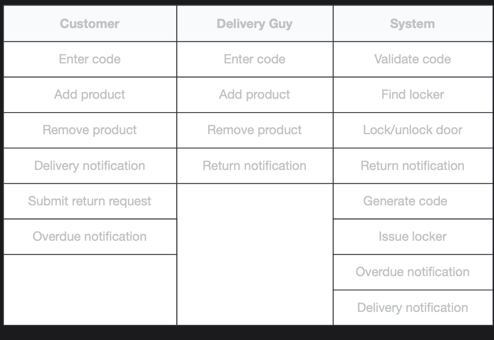
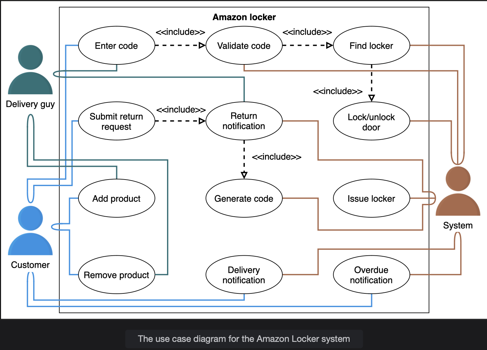

# Use Case Diagram for the Amazon Locker Service

Learn how to define use cases and create the corresponding use case diagram for the Amazon Locker system.

> We'll cover the following:
>
> - System
> - Actors
> - Use Cases
> - Relationships
> - Use case diagram

Let's build the use case diagram of the Amazon Locker system and understand the relationship between its different components.

First, we'll define the different elements of our system, followed by the complete use case diagram of the system.

## System

Our system is "Amazon Locker."

## Actors

Now, we'll define the main actors of our Amazon Locker system.

#### Primary actors

- **Customer:** This is Amazon's customer who ordered a package delivered to the Amazon Locker. It can enter the code at the locker and gets its product.  
   This actor can also request a return and put the package back at the locker.
- **Delivery guy:** This can also enter the code and add the product to the locker so the "Customer" can pick it up.  
   This actor can pick up a returned package from the locker.

#### Secondary actors

- **System:** This can send the delivery and due date notifications, generate code, and choose a locker.  
   It can also find the locker and open or close the locker door.

## Use Cases

This section will define the use case for lockers. We have listed the use cases according to their respective interactions with a particular actor.

> **NOTE:** You will see some use cases occurring multiple times because they are shared among different actors in the system.

#### Customer

- **Enter code:** To enter code to open a locker
- **Add product:** To add a product to the locker
- **Remove product:** To pick up the product from the locker
- **Delivery notification:** To notify about the product location status
- **Submit return request:** To submit a return request to return a product
- **Overdue notification:** To notify if the date and time for the product pickup are passed

#### Delivery guy

- **Enter code:** To enter the code to open a locker
- **Add product:** To add a product to the locker
- **Remove product:** To pick up the product from the locker
- **Return notification:** To notify about the product return status

#### System

- **Validate code:** To validate the locker code entered
- **Find locker:** To find the locker as per the code entered
- **Lock/unlock door:** To lock or unlock the door lock
- **Return notification:** To notify about the product return status
- **Generate code:** To generate the locker code
- **Issue locker:** To issue the appropriate locker depending upon the product size
- **Overdue notification:** To mnotify if the date and time for the product pickup are passed
- **Delivery notification:** To notify about the product location status

## Relationships

We describe relationships between and among actors and their use cases in this section.

#### Associations

The table below shows the association relationship between actors and their use cases.

#### Include

- When a "Customer" enters a code, the system then checks if the code is correct or not and finds the locker according to the code entered. Then, the system unlocks the door. This means that:
  - The "Enter code" use case has an include relationship with the "Validate code" use case.
  - The "Validate code" use case has an include relationship with the "Find locker" use case.
  - The "Find locker" use case has an include relationship with the "Lock/unlock door" use case.
- To return a product, the customer must go to the Amazon website and submit a return request. After the approval of the request, Amazon Locker will generate a code that will be used to acces the locker.
  - The "Submit return request" use case has an include relationship with the "Request notification" use case.
  - The "Request notification" use case has an include relationship with the "Generate code" use case.

## Use case diagram

Here's the use case diagram for the Amazon Locker system:

In the next lesson, we will discuss the class diagram with a detailed explanation of all classes and their relationship with each other.
